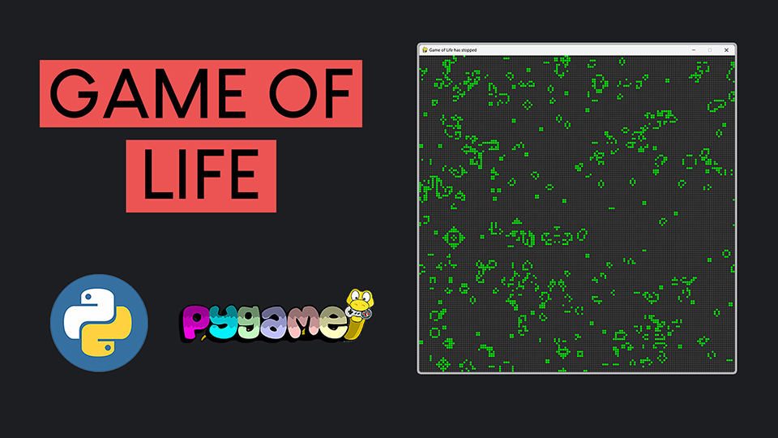

# Python Game Of Life with Pygame

Welcome to the easiest introduction to game development with pygame in python. If you're new to pygame, you're in the right place to start your journey. In this video, I will guide you through the installation process of pygame on your Windows computer and we are going to build a simple pygame project from scratch. We'll be using Python with Sublime Text to develop a basic pygame program featuring a keyboard-controlled ball. The entire procedure is very easy and should take no more than 20 minutes.

## How to Run the Program

Getting started with the Game of Life simulation is straightforward. After cloning the repository and setting up your environment as outlined in the README, you're ready to launch the program and engage with the interactive simulation. Here's your guide to controlling and interacting with the Game of Life:

- **Start the Simulation**: Press `Enter` to initiate the simulation. Observe as the cells transition through generations, adhering to the Game of Life's rules.
- **Pause/Stop the Simulation**: Hit the `Spacebar` to pause the simulation at any moment. Press `Spacebar` again to resume.
- **Create a Random Initial State**: Tap `R` to populate the grid with a random mix of alive and dead cells, perfect for kicking off a new simulation with unforeseen developments.
- **Clear the Grid**: Want a clean slate? Press `C` to clear the grid, turning all cells to a dead state.
- **Adjust Simulation Speed**:
  - Increase the pace by pressing `F`, making the generations evolve quicker.
  - Slow things down with `S`, giving you a closer look at each generation's transformation.
- **Toggle Cell States with Mouse Click**: Click on any cell within the grid to toggle its state. Bringing an alive cell to death or reviving a dead cell allows you to manually craft or alter patterns and see how they unfold.

With these controls at your disposal, you have complete mastery over the simulation, offering a sandbox to explore the depth of the Game of Life from your perspective. Try out various initial setups, speeds, and patterns to uncover the endless possibilities hidden within this simple, yet profound simulation. Dive into the captivating world of cellular automata and enjoy the exploration!

# Video Tutorial

  

🎥 <a href = "https://youtu.be/uR0lNADr4dc">Video Tutorial on YouTube</a>

 
 

| 📺 <a href="https://www.youtube.com/channel/UC3ivOTE5EgpmF2DHLBmWIWg">My YouTube Channel</a>
| 🌍 <a href="http://www.educ8s.tv">My Website</a> |  

 
